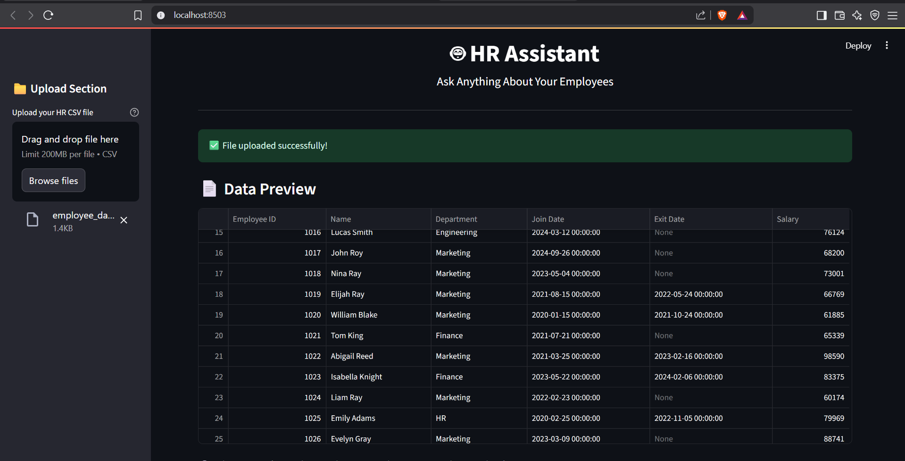

# 🤖 AI-Powered HR Assistant (Streamlit + Mistral via Ollama)

This project is an **AI-powered HR assistant** that lets you ask natural language questions about your employee dataset. It combines:
- 📊 **Pandas & Rule-based Parsing**
- 💡 **Local LLMs** using [Mistral 7B via Ollama](https://ollama.com/)
- ⚙️ **Streamlit** for a fast, interactive UI

---

## 📺 Demo Video

🔗 **Watch on YouTube**: [https://youtu.be/ZDJxEy8Dvwk](https://youtu.be/ZDJxEy8Dvwk)

---

### ✅ Application Interface  


---

## 🛠 Features

- 🔍 Upload any employee dataset (`.csv`)
- 💬 Ask natural language questions like:
  - “How many employees exited in 2023?”
  - “Show me average salary by department”
  - "List departments with more than 5 employees."
  - “What is the average salary in Engineering?”
  - “Show employee count by department.”
  - “Show me all employees who joined after January 2023.”
  - Who joined in 2023?”
  - “How many employees joined in 2024?”

- 📊 Get visual charts for trends like department count
- ⚡ Works fully **offline** using **local LLMs** via [Ollama](https://ollama.com)

---

## 🚀 How to Run the Project Locally

### 1️⃣ Clone the Repository

```bash
git clone https://github.com/anandu91/hr-assistant-anandakrishnan.git
cd hr-assistant-anandakrishnan


2️⃣ Create and Activate a Virtual Environment

<details> <summary>🔵 Windows</summary>
python -m venv venv
.\venv\Scripts\activate
</details> <details> <summary>🟢 Mac/Linux</summary>
python3 -m venv venv
source venv/bin/activate
</details>

3️⃣ Install Required Dependencies
pip install -r requirements.txt


4️⃣ Start the Ollama LLM
Make sure Ollama is installed and the Mistral model is available.
ollama run mistral
💡 You can replace mistral with any other local model supported by Ollama.

5️⃣ Launch the Streamlit App
streamlit run app.py
The app will open at: http://localhost:8501


💼 Sample Dataset

A sample file is available at: data/employee_data.csv


